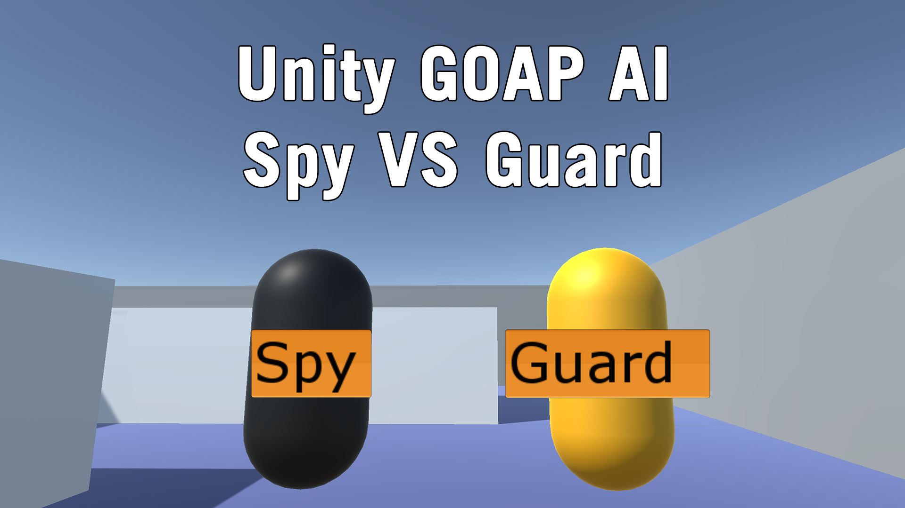

# Sidescrolling Agents
This Unity project provides a scenario including reactive ‘Guard’ AI agents and a planning based ‘Spy’ AI agent. The role of the ‘Guard’ agents is to patrol a given area and react to the ‘Spy’ in an attempt to catch them. The role of the ‘Spy agent is to avoid the ‘Guard’ agents to successfully achieve its goals (Find a key and get to the exit).

This project uses a Goal Oriented Action Planning method to drive the guards, this allows them to make their own decisions by pathfinding through their available actions to reach a goal.
## Links
* [Github repository](https://github.com/danielmccluskey/Unity-AI-SpyVsGuard)  
* [YouTube video Showcasing the project](https://www.youtube.com/watch?v=0Y1EGevHg1s)
